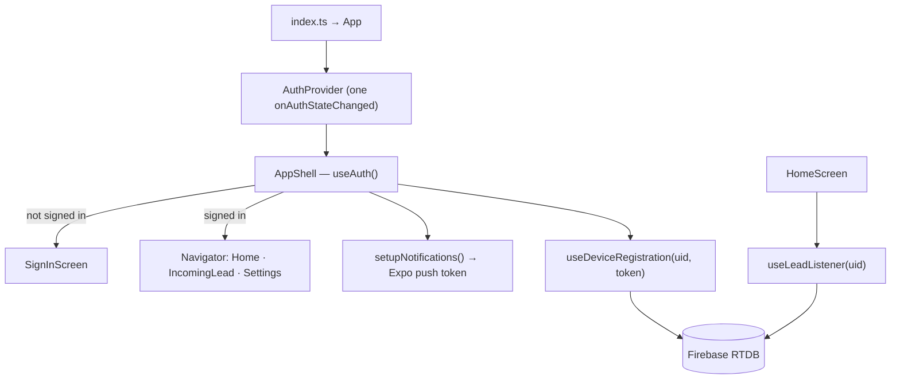
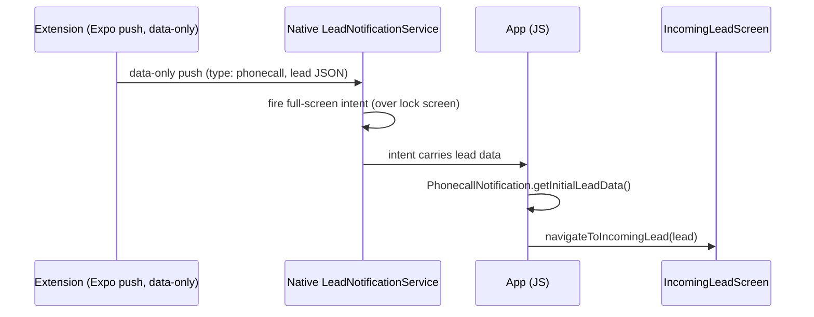

# Architecture — Lead Notifier (mobile app)

How the phone app is wired: the auth session seam, device registration, the lead listener, the four
ways a lead reaches the UI, the native full-screen-intent path, and the Firebase data model. Read the
[README](../README.md) first for setup; this covers the "why".

---

## App wiring

`index.ts` registers `App`. `App` provides the single auth session and, once signed in, mounts the
navigation stack and starts the background pieces.



- **`AuthProvider` (`hooks/AuthProvider.tsx`)** holds the **one** `onAuthStateChanged` subscription
  for the whole app and configures Google Sign-In once. Every screen reads it via `useAuth()`.
  (Previously three components each mounted their own subscription — see the refactor history.)
- **`setupNotifications()`** requests permission, creates the Android channels, and returns the Expo
  push token.
- **`useDeviceRegistration(uid, token)`** writes this device to Firebase once both are available.
- **`useLeadListener(uid)`** (mounted by `HomeScreen`) subscribes to new leads and fires the alert.

---

## Device identity (`deviceIdentity.ts`)

One module owns the device's identity and its Firebase location, consumed by both
`useDeviceRegistration` (writes the record) and `useNotificationStyle` (updates the style):

- `getOrCreateDeviceId()` — a **stable** id (Android ID / iOS identifierForVendor), cached in
  AsyncStorage, with a random fallback. Stable ids stop the "N phones" count inflating on reinstall.
- `getStoredDeviceId()` — the cached id only (no side effect), for callers that must not create one.
- `deviceRef(uid, id)` — the `devices/{uid}/{deviceId}` Realtime Database reference, defined once.

---

## How a lead reaches the UI

A lead can arrive through **four** paths, all converging on `navigateToIncomingLead(lead)`
(`navigation.ts`). This redundancy covers foreground, background, and killed states:

| Path | When | Where |
|---|---|---|
| **Live listener** | app running, new lead written to RTDB | `useLeadListener` (`onChildAdded`) |
| **Notification tap** | user taps a notification (app backgrounded) | `App.tsx` response listener |
| **Cold start** | app launched by tapping a notification | `App.tsx` `getLastNotificationResponseAsync` |
| **Full-screen intent** | phonecall style, killed/warm state | `App.tsx` `PhonecallNotification.getInitialLeadData()` |

In the live listener, **phonecall** style navigates immediately (foreground) or posts the native
full-screen intent (background); **headsup** style calls `fireLeadNotification` (banner). Both derive
their text from the single `leadNotificationText(payload)` in `notifications.ts`.

---

## Native full-screen intent (phonecall style)

The full-screen "incoming call" behavior isn't standard Expo — it's a native Android module written
by the Expo **config plugin** `plugins/withFullScreenIntent.ts` at prebuild, bridged to JS via
`modules/PhonecallNotification.ts`.



A **data-only** push (no title/body) is used so Android doesn't auto-display it as a banner — the
native service decides how to present it. Android 14+ requires the user to grant full-screen-intent
permission (requested from Settings when phonecall is selected).

---

## Firebase RTDB data model

Both apps share one Realtime Database:

```
leads/{uid}/new/{pushId}     ← extension writes; this app's useLeadListener reads (onChildAdded)
  { title, buyerName, buyerMobile, quantity, city, state, timestamp }

devices/{uid}/{deviceId}     ← this app writes; the extension reads to know where to push
  { fcmToken, notificationStyle: "headsup" | "phonecall", lastSeen }
```

The listener queries `leads/{uid}/new` ordered by `timestamp`, starting at the moment it mounts, so
only genuinely new leads fire an alert.

---

## Cross-repo wire contract

This app and the [extension](https://github.com/Nadhim002/indiamart-extension) are separate repos
sharing three formats **by convention, not shared code**:

1. **Channel IDs** (`channels.ts` ↔ extension `src/shared/channels.ts`) — a mismatch makes Android
   silently drop the notification.
2. **Firebase project** — both talk to the same RTDB with the data model above.
3. **Expo push payload** — the phonecall (data-only) vs banner shape the extension's
   `buildExpoMessage` produces and this app consumes.

Change any of these and update both repos together.
